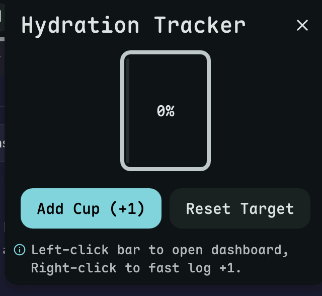

# Hydrate

Distraction-free drink water reminder and tracker.



## Install

Use the DMS CLI:
```bash
dms plugins install hydrate
```

Or manually:
```bash
git clone https://github.com/hthienloc/dms-hydrate ~/.config/DankMaterialShell/plugins/hydrate
```

## Features

- **Water Reminders** - Changes icon on the bar to remind you to drink
- **Progress Tracker** - Click to see daily progress and logged cups
- **Quick Log** - Right-click the bar icon to instantly add 1 cup
- **Easy Config** - Change daily goals and interval in settings

## Usage

| Action | Result |
|--------|--------|
| Left click | Toggle popout dashboard |
| Right click | Fast increment cup count by +1 |

## License

GPL-3.0

## Roadmap / TODO

- [ ] **Custom Container Sizes**: Log custom liquid measurements (ml/oz) with quick preset containers (Bottle, Glass, Mug).
- [ ] **Hydration History Chart**: Visualize daily/weekly progress trends via inline graphs in the dashboard.
- [ ] **Ambient Reminder Speeds**: Intelligent reminder frequency scaling based on dynamic physical activities or system uptime.
- [ ] **Sound Alerts Toggle**: Optional subtle water droplet audio chime toggles for optional notification.
- [ ] **DND Integration**: Automatically silence bar reminders during full-screen apps or focus mode.
- [ ] **Data Export/Import**: Backup logged hydration history stats to CSV or JSON formats.
